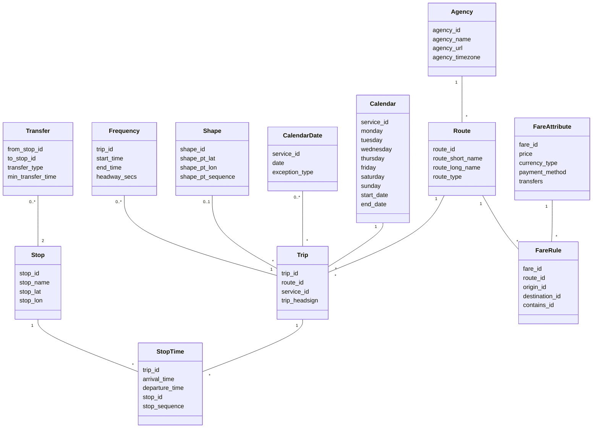

# GTFS2STN application
An application loads General Transit Feed Specification (GTFS) transit file and convert it to spatio-temporal
network (STN) for shortest path analysis.

If you use the tool, consider cite the following paper:
- [*GTFS2STN: Analyzing GTFS Transit Data By Generating Spatiotemporal Transit Network*](https://arxiv.org/abs/2405.02760)

## Quick explore online (please visit: https://gtfs2stn.streamlit.app/): 

## Run app using docker (recommended way)

Download the docker file from DockerHub with the following command:
```
docker pull friedbee/gtfs2stn:latest
```

You could view the image settings using the following link: https://hub.docker.com/layers/friedbee/gtfs2stn/latest/images/sha256:fe81c3cfdcf022fe6b56b540e44f5a8c37e62aa0c99f912484469ec452a21f91?uuid=4F0A5E81-8B5D-4335-8A84-199956C16020

Then, run the docker container using the command:
```
docker run -p 8501:8501 friedbee/gtfs2stn
```

After that, visit the following website (http://localhost:8501)

# Recent updates
- October, 2024 (version 2.0)
  - use rustworkx to substitute networkx for better running efficiency
  - write pytest code to safeguard core code

# GTFS core structure


