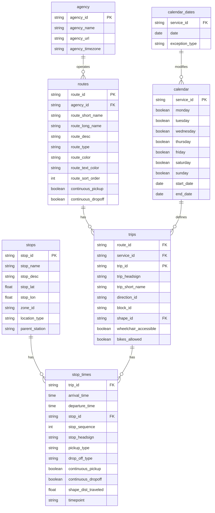

```mermaid
erDiagram
    stops ||--o{ stop_times : has
    stops {
        string stop_id PK
        string stop_name
        string stop_desc
        float stop_lat
        float stop_lon
        string zone_id
        string location_type
        string parent_station
    }

    trips ||--o{ stop_times : has
    trips {
        string route_id FK
        string service_id FK
        string trip_id PK
        string trip_headsign
        string trip_short_name
        string direction_id
        string block_id
        string shape_id FK
        boolean wheelchair_accessible
        boolean bikes_allowed
    }

    routes ||--o{ trips : has
    routes {
        string route_id PK
        string agency_id FK
        string route_short_name
        string route_long_name
        string route_desc
        string route_type
        string route_color
        string route_text_color
        int route_sort_order
        boolean continuous_pickup
        boolean continuous_dropoff
    }

    agency ||--o{ routes : operates
    agency {
        string agency_id PK
        string agency_name
        string agency_url
        string agency_timezone
    }

    calendar ||--o{ trips : defines
    calendar {
        string service_id PK
        boolean monday
        boolean tuesday
        boolean wednesday
        boolean thursday
        boolean friday
        boolean saturday
        boolean sunday
        date start_date
        date end_date
    }

    calendar_dates ||--o{ calendar : modifies
    calendar_dates {
        string service_id FK
        date date
        string exception_type
    }

    stop_times {
        string trip_id FK
        time arrival_time
        time departure_time
        string stop_id FK
        int stop_sequence
        string stop_headsign
        string pickup_type
        string drop_off_type
        boolean continuous_pickup
        boolean continuous_dropoff
        float shape_dist_traveled
        string timepoint
    }

```

